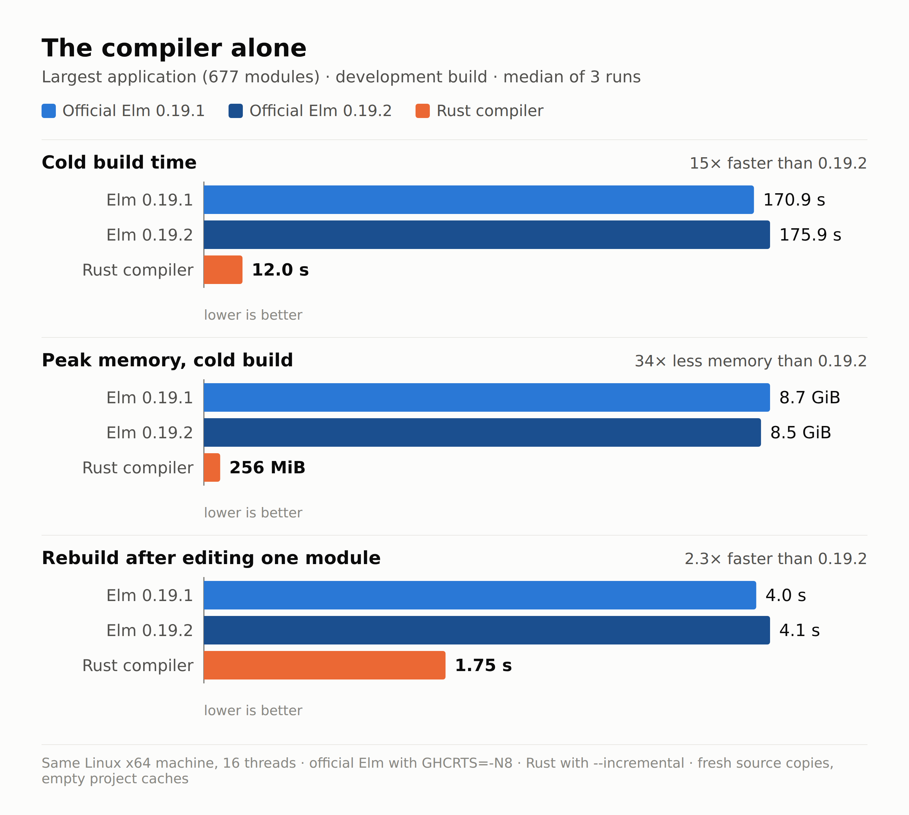

# Elm compiler in Rust

An independent, **unofficial** reimplementation of the [Elm](https://elm-lang.org)
0.19 compiler, written in Rust. It parses, type-checks and generates
JavaScript by itself — it never calls the official Haskell compiler.

It was built to compile a large production Elm codebase (ten applications,
677 modules) faster and with far less memory. Largest application, development
build (no `--optimize`), median of 3 runs on the same machine:

|                                  | Elm 0.19.1        | Elm 0.19.2        | This compiler        |
| -------------------------------- | ----------------- | ----------------- | -------------------- |
| Cold build                       | 170.9 s · 8.7 GiB | 175.9 s · 8.5 GiB | **12.0 s · 256 MiB** |
| Rebuild after editing one module | 4.0 s · 1.2 GiB   | 4.1 s · 1.2 GiB   | **1.75 s · 250 MiB** |

_Linux x64, 16 threads, official Elm with 8 threads (`GHCRTS=-N8`), empty
project caches, shared package cache, excluding bundling. This is one large
codebase: Elm 0.19.2 reports large gains on other projects, and your
numbers will differ; please share them in an issue._

<p align="center"></p>

> **Status: alpha.** It compiles real applications that pass their test suites
> and aims at full compatibility with Elm 0.19.1 and 0.19.2, with a few deliberate differences
> listed below. Read [Compatibility](#compatibility) before relying on it.

This project is not affiliated with or endorsed by the Elm project.

---

## Install

Prebuilt binaries are shipped inside the npm package for:

| OS            | x64 | ARM64 |
| ------------- | --- | ----- |
| Linux (glibc) | ✅  | ✅    |
| macOS         | ✅  | ✅    |
| Windows       | ✅  | —     |

Alpine/musl and other targets: [build from source](#build-from-source).

```sh
# In an Elm project: replace the official compiler
npm uninstall elm
npm install --save-dev @spottt/elm-compiler
npx elm make src/Main.elm --output=main.js

# Or without installing
npx @spottt/elm-compiler make src/Main.elm --output=main.js
```

The package provides the **`elm`** command, so it is a drop-in replacement:
scripts and tools that call `elm` pick it up. Install it **instead of** the
official `elm` npm package, not alongside it — both provide the same command.
`planexpo-elm` is kept as an alias.

The package has **no install scripts**: nothing is downloaded or compiled at
`npm install` time. The binary for your platform is already inside the tarball
and its SHA-256 is recorded in `checksums.json`. Releases are published from
CI with [npm provenance](https://docs.npmjs.com/generating-provenance-statements).

Every release is published under the default `latest` tag. Experimental builds
(versions such as `0.4.0-next.1`) use the `next` tag:
`npm install --save-dev @spottt/elm-compiler@next`.

Standalone binaries (`elm-compiler-<version>-<platform>.tar.gz`, a single
`elm` executable) and a
`SHA256SUMS` file are attached to every
[GitHub Release](https://github.com/Spottt/elm-compiler/releases).

## Usage

The command line mirrors `elm`, commands and flags included:

```sh
elm init                                   # create elm.json and src/
elm install elm/http                       # add a dependency
elm make src/Main.elm --output=main.js
elm make src/Main.elm --output=index.html
elm make src/Main.elm --optimize --output=main.js
elm make src/Main.elm --debug --output=main.js   # time-travelling debugger
elm make src/A.elm src/B.elm --output=bundle.js  # several entry points
elm make --docs=docs.json                  # in a package: check + docs
elm repl
elm reactor --port=8000
elm diff elm/json 1.0.0 1.1.3
elm bump
elm publish
```

Additional `make` flags:

| Flag            | Effect |
| --------------- | ------ |
| `--incremental` | Reuse cached per-module results between runs (large win in watch mode). |
| `--no-cache`    | Neither read nor write the generated-code and type caches. |

`--report=json` behaves like `elm make --report=json`.

Environment variables:

| Variable                   | Effect |
| -------------------------- | ------ |
| `ELM_HOME`                 | Package cache location, as with official Elm (default `~/.elm`). |
| `PLANEXPO_ELM_RUST_BINARY` | Absolute path of a binary the npm launcher runs instead of the bundled one (e.g. your own build). |

Missing packages are downloaded from `package.elm-lang.org` into `ELM_HOME`
and their archive hashes are verified. Builds work offline once the cache is
populated.

### Persistent compiler for watch mode

`elm --make-worker` keeps one compiler process alive and takes `make` requests
as JSON lines on stdin. Between requests it keeps the project and the analysis
of unchanged modules in memory, so rebuilding after an edit is much cheaper
than a new `elm make` (0.82 s vs 1.75 s after a value edit on our largest
application). It is meant for bundler plugins, dev servers and editors; the
protocol is documented in [docs/worker.md](docs/worker.md).

Bundler integration (a Webpack/Vite plugin, hot reload that re-sends only the
changed JavaScript) is not published yet: at Planexpo it lives in our own
Webpack setup.

### With existing tooling

Tools that look for `elm` in `node_modules/.bin` find it without any
configuration when run through `npx` or npm scripts:

```sh
npx elm-test
```

```js
// webpack + elm-webpack-loader: nothing to configure; or explicitly
{ loader: 'elm-webpack-loader', options: { pathToElm: 'node_modules/.bin/elm' } }
```

From JavaScript, `require('@spottt/elm-compiler').resolveBinary()` returns the
absolute path of the native executable.

## Compatibility

Target: **Elm 0.19**, the language shared by 0.19.1 and 0.19.2. Projects
declaring `"elm-version": "0.19.1"` or `"0.19.2"` are both accepted.

The reference implementation for the differential checks in `scripts/` is Elm
0.19.1 (elm/compiler tag `0.19.1`, commit `c9aefb6`): diagnostics are compared
with the official binary, text and JSON. The same checks have not been run
systematically against the 0.19.2 binary yet; the defects listed below were
re-checked against it one by one.

Implemented: `init`, `install`, `make` (JavaScript/HTML output, several entry
points, `--optimize`, `--debug`, `--docs`, `--report=json`), `repl`, `reactor`,
`diff`, `bump`, `publish`; applications and packages, dependency resolution,
package download and verification; ports, effect managers, kernel code, WebGL
shaders.

Deliberate differences — cases where official Elm has a known defect that this
compiler does not reproduce (status in 0.19.2 re-checked on 2026-09-28):

- It rejects a recursive-capture program that official Elm accepts although it
  sends `undefined` through a port typed `Int` (0.19.1 and 0.19.2).
- It fixes the negation of overflowing integer literals, for which official Elm
  emits invalid JavaScript (0.19.1 and 0.19.2).
- TLS is stricter when downloading packages: certificates restricted to client
  authentication are refused (accepted by 0.19.1 and 0.19.2), as are
  certificates with unknown critical extensions (accepted by 0.19.1 only).
- `elm.json` errors reported as JSON are always valid JSON: official Elm can
  emit unescaped control characters (0.19.1 and 0.19.2) or crash on some
  first-line errors (0.19.1 only), and can time out on some malformed one-line
  manifests (0.19.1 and 0.19.2).

Compatibility is checked by differential tests against the official binary, by
the historical Elm test programs in `tests/upstream/` (33/33 identical decisions
and JSON diagnostics) and by real applications.

**If a program behaves differently with official Elm and with this compiler —
accepted or rejected, error message, runtime behaviour — that is a bug.**
Please [open an issue](https://github.com/Spottt/elm-compiler/issues) with a
minimal `elm.json` and module.

## Build from source

Requirements: Rust **1.98.1** (pinned in `rust-toolchain.toml`, installed
automatically by rustup), Node ≥ 18 for the npm tooling.

```sh
git clone https://github.com/Spottt/elm-compiler.git
cd elm-compiler
cargo build --locked --release
./target/release/planexpo-elm make path/to/src/Main.elm --output=main.js
```

To try your build through npm exactly as users receive it:

```sh
node distribution/pack-local.mjs --out dist
# → dist/spottt-elm-compiler-<version>.tgz, current platform only
cd /path/to/an/elm/project
npm install --save-dev /path/to/elm-compiler/dist/spottt-elm-compiler-<version>.tgz
npx elm --version
```

Or keep the published package and swap only the binary:

```sh
PLANEXPO_ELM_RUST_BINARY=/path/to/elm-compiler/target/release/planexpo-elm npx elm make src/Main.elm
```

## Repository layout

| Path            | Content |
| --------------- | ------- |
| `src/`          | The compiler (library `planexpo_elm` + binary `planexpo-elm`, installed as `elm` by the npm package). |
| `tests/`        | Rust integration tests. `tests/upstream/` holds unmodified upstream fixtures under their own licenses. |
| `scripts/`      | Differential checks against the official `elm` binary (Python/Node). |
| `reactor/`      | Sources and compiled assets of the `reactor` interface (from elm/compiler). |
| `vendor/`       | Patched Rust dependencies (see `vendor/README.md`). |
| `examples/`     | Small probes used by differential tests (REPL, registry, docs). |
| `npm/`          | Source of the npm package: launcher, platform resolution, checksum check. It contains no binaries. |
| `distribution/` | Release assembly (`stage-release.mjs`), local packing (`pack-local.mjs`) and their tests. |
| `.github/workflows/release.yml` | CI on every push/PR; npm + GitHub release on version tags. |

## Contributing and releasing

- [CONTRIBUTING.md](CONTRIBUTING.md) — development workflow, tests, reporting compatibility bugs.
- [RELEASING.md](RELEASING.md) — publishing a version, and publishing a fork under your own npm scope.
- [CHANGELOG.md](CHANGELOG.md)

## License

[BSD 3-Clause](LICENSE), Copyright (c) 2026 Spottt.

This compiler is derived from the Elm compiler and includes code, assets or
fixtures from Elm packages, GHC's base library, language-glsl, Adobe's Source
fonts and patched Rust crates; their licenses are in `LICENSE-*`,
`reactor/licenses/` and `vendor/`. See [NOTICE](NOTICE).
